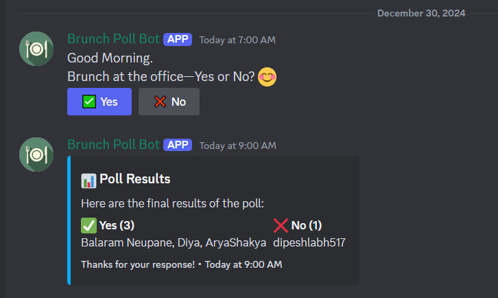

# Discord Poll DB

## Issue:

For the brunch at the office, employees are required to type "Yes" or "No" on a Discord channel. However, this often leads to low engagement as some employees forget or skip responding.

## Solution:

The **Discord Poll DB** bot automates the process by regularly reminding users of the brunch poll. The bot posts a message in a designated Discord channel every weekday at 7 AM (Nepal Time), with options to vote "Yes" or "No" for brunch. It also collects and displays the results after a predefined period (e.g., 2 hours).



### Features:

- **Automated Polling**: Sends daily poll reminders for brunch at the office.
- **Simple Voting**: Users can vote with a button click ("Yes" or "No").
- **Poll Results**: After a set time (2 hours), the bot displays the list of users who voted "Yes" or "No".
- **Recurring Polling**: Polling happens from Monday to Friday at 7 AM (Nepal Time).
- **Holiday Integration**: Automatically skips polling on holidays, sending a friendly holiday message instead (e.g., "🎉 Today is [Holiday Name]. Enjoy your holiday!").

---

## Installation

1. Clone the repository:

```bash
git clone https://github.com/dnesbala/discord-poll-bot
cd discord-poll-db
```

2. Install dependencies:

```bash
npm install
```

3. Set up your `.env` file with the following (refer to the provided `.example.env` file):

```bash
DISCORD_TOKEN=your_discord_bot_token
DISCORD_CHANNEL_ID=your_discord_channel_id_where_to_ask_poll
```

4. Start the bot:

```bash
npm start
```

Note: Update discord channel id on code if required.

## Cron Job Setup

The bot uses the `node-cron` library to schedule the poll reminder to run at 7 AM every Monday to Friday. You can modify the schedule in the code if needed.

Example cron expression for 7 AM Monday to Friday:

```javascript
cron.schedule(
  "0 7 * * 1-5",
  () => {
    // Poll logic here
  },
  { timezone: "Asia/Kathmandu" }
);
```

You can change this to another time by adjusting the cron expression.

## How It Works

1. The bot sends a message in the designated Discord channel every weekday at 7 AM (Nepal Time) with the following poll options:

   - **Yes**: Users want brunch.
   - **No**: Users do not want brunch.

2. Users vote by clicking on the **Yes** or **No** buttons.

3. After 2 hours, the bot automatically collects all responses and posts the results in the same channel.

## Contributing

To contribute to this project, follow these steps:

1. Fork the repository.

2. Create a feature branch:

   ```bash
   git checkout -b feature-branch
   ```

3. Commit your changes:

   ```bash
   git commit -am 'Add new feature'
   ```

4. Push to the branch:

   ```bash
   git push origin feature-branch
   ```

5. Open a Pull Request.
